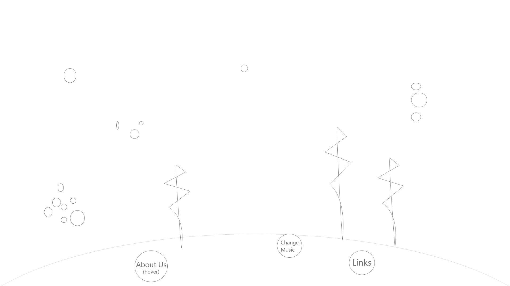
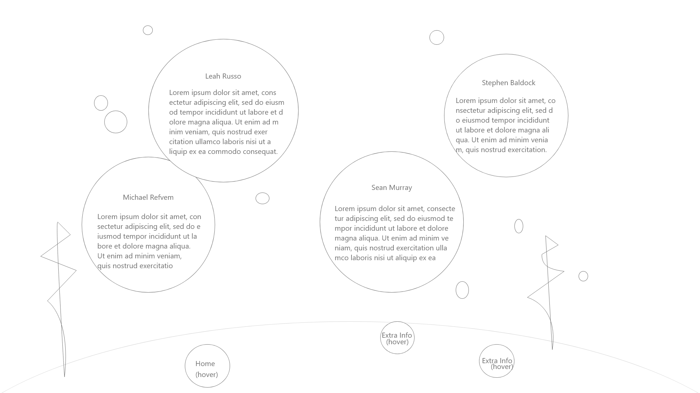

# Team While() 201 final project

## The Team:

- [Leah](https://github.com/leahgrace555)
- [Micheal](https://github.com/MRefvem)
- [Stephen](https://github.com/SBALDOCK)
- [Sean](https://github.com/seanjmurray)

## Project

Our goal is to create a zen like web app that gives the user a virtual fish tank to interact with and unwind watching. 

## Tasks to complete

- [ ] Footer with links
- [ ] Canvas with moving fish

- [ ] Finish everything

## Wireframe
## Index

## About

